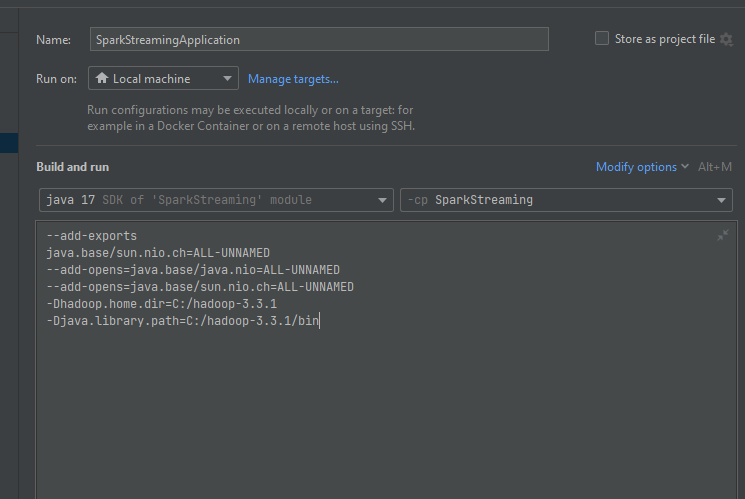

Spark Streaming :

    The application uses version 3.4.0 of spark streaming.

    I use Spark Structured Streaming because DStream is deprecated.

    The application uses Spring boot 2.7.10 version, because the Jersey Servlet is missing on version 3.0.5, making it unable to start properly.

    In the application I use Apache Hadoop version 3.3.1, but running on windows I also had to add files compacted in this repo https://github.com/kontext-tech/winutils/tree/master/hadoop-3.3.1/bin, more detailed instructions https://kontext.tech/article/829/install-hadoop-331-on-windows-10-step-by-step-guide. On linux you should not have this problem.
   
    I use java 17 in project, Apache Hadoop version 8
   
    I also set the paths in the application configuration, since the settings in the local environment variables did not help.
    
    VM options 
    --add-exports
    java.base/sun.nio.ch=ALL-UNNAMED
    --add-opens=java.base/java.nio=ALL-UNNAMED
    --add-opens=java.base/sun.nio.ch=ALL-UNNAMED
    -Dhadoop.home.dir=C:/hadoop-3.3.1
    -Djava.library.path=C:/hadoop-3.3.1/bin

    

    
    